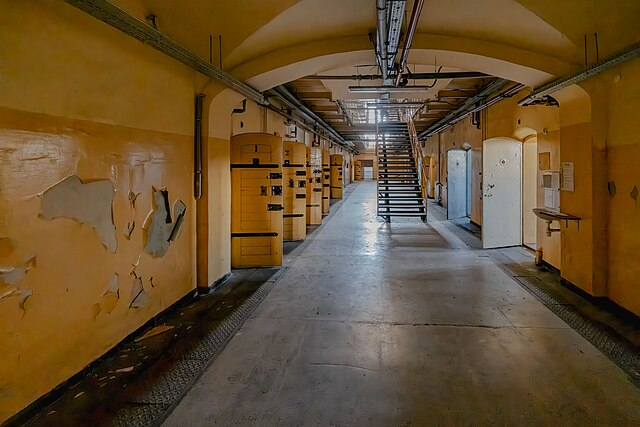

<html lang="es">
<head>
  <meta charset="UTF-8">
  <meta name="viewport" content="width=device-width, initial-scale=1">
  ---
<h1> Libros publicados</h1>
  ---
  <link rel="stylesheet" href="style.css">
</head>
  

<body>
  

    
    
Titulo del libro, datos generales y breve resumen.

    
    
Titulo del libro, datos generales y breve resumen.

    
    
Titulo del libro, datos generales y breve resumen.

  

</body>
</html>

